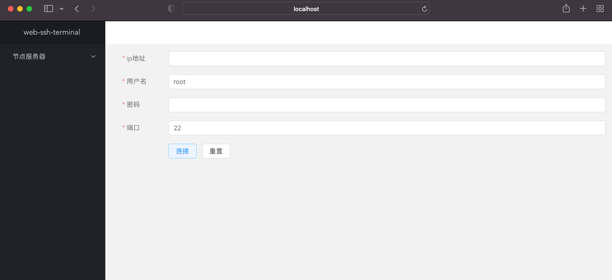
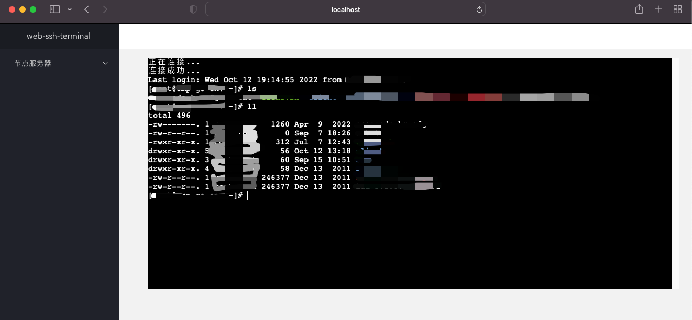

# websshterminal
> go+echo+ssh+websocket+vue3 实现的web端通过ssh连接服务器

<a href="https://github.com/jeffcail/websshterminal/releases">
    
  </a>
   <a href="https://github.com/jeffcail/websshterminal/blob/master/LICENSE">
    
  </a>


## web vue代码
[websshterminal-vue](https://github.com/jeffcail/websshterminal-vue)


## 运行
```shell
go run main.go
```

## 访问
localhost:5555

## 效果展示
添加服务器



模拟终端

